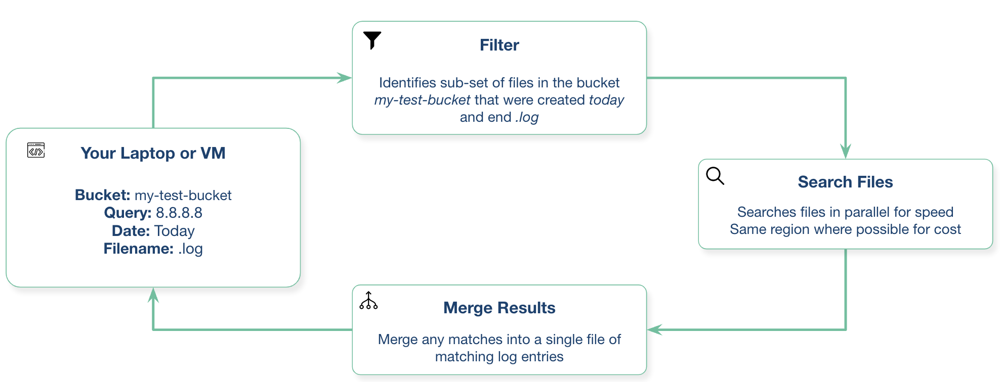

# cloudgrep #
cloudgrep searches cloud storage.

 [](https://opensource.org/licenses/Apache-2.0)


It currently supports searching log files, optionally compressed with gzip (.gz) or zip (.zip), in AWS S3, Azure Storage or Google Cloud Storage.



### Why? ###
- Directly searching cloud storage, without indexing logs into a SIEM or Log Analysis tool, can be faster and cheaper.
- There is no need to wait for logs to be ingested, indexed, and made available for searching.
- It searches files in parallel for speed.
- This may be of use when debugging applications, or investigating a security incident.

### Example ###

Simple example:
```
./cloudgrep --bucket test-s3-access-logs --query 9RXXKPREHHTFQD77
python3 cloudgrep.py -b test-s3-access-logs -q 9RXXKPREHHTFQD77
```

Simple Azure example:
```
python3 cloudgrep.py -an some_account -cn some_container -q my_search
```

Simple Google example:
```
python3 cloudgrep.py -gb my-gcp-bucket -q my_search
```

Simple CloudTrail log example, outputting results as JSON:
```
python3 cloudgrep.py -b test-s3-access-logs -q 9RXXKPREHHTFQD77 -lt cloudtrail -jo
```

Simple custom log example:
```
python3 cloudgrep.py -b test-s3-access-logs -q 9RXXKPREHHTFQD77 -lf json -lp Records
```

More complicated example:
```
python3 cloudgrep.py -b test-s3-access-logs --prefix "logs/" --filename ".log" -q 9RXXKPREHHTFQD77 -s "2023-01-09 20:30:00" -e "2023-01-09 20:45:00" --file_size 10000 --debug
```

Saving the output to a file:
```
python3 cloudgrep.py -b test-s3-access-logs -q 9RXXKPREHHTFQD77 --hide_filenames > matching_events.log
```

Example output:
```
[2023-11-30 13:37:12,416] - Bucket is in region: us-east-2 : Search from the same region to avoid egress charges.
[2023-11-30 13:37:12,417] - Searching 11 files in test-s3-access-logs for 9RXXKPREHHTFQD77...
{"key_name": "access2023-01-09-20-34-20-EAC533CB93B4ACBE", "line": "abbd82b5ad5dc5d024cd1841d19c0cf2fd7472c47a1501ececde37fe91adc510 bucket-72561-s3bucketalt-1my9piwesfim7 [09/Jan/2023:19:20:00 +0000] 1.125.222.333 arn:aws:sts::000011110470:assumed-role/bucket-72561-myResponseRole-1WP2IOKDV7B4Y/1673265251.340187 9RXXKPREHHTFQD77 REST.GET.BUCKET - \"GET /?list-type=2&prefix=-collector%2Fproject-&start-after=&encoding-type=url HTTP/1.1\" 200 - 946 - 33 32 \"-\" \"Boto3/1.21.24 Python/3.9.2 Linux/5.10.0-10-cloud-amd64 Botocore/1.24.46\" - aNPuHKw== SigV4 ECDHE-RSA-AES128-GCM-SHA256 AuthHeader bucket-72561-s3bucketalt-1my9piwesfim7.s3.us-east-2.amazonaws.com TLSv1.2 - -"}
```

### Arguments ###
```
usage: cloudgrep.py [-h] [-b BUCKET] [-an ACCOUNT_NAME] [-cn CONTAINER_NAME] [-gb GOOGLE_BUCKET] [-q QUERY]
                    [-v FILE] [-y YARA] [-p PREFIX] [-f FILENAME] [-s START_DATE] [-e END_DATE]
                    [-fs FILE_SIZE] [-pr PROFILE] [-d] [-hf] [-lt LOG_TYPE] [-lf LOG_FORMAT]
                    [-lp LOG_PROPERTIES] [-jo JSON_OUTPUT]

CloudGrep searches is grep for cloud storage like S3 and Azure Storage. Version: 1.0.5

options:
  -h, --help            show this help message and exit
  -b BUCKET, --bucket BUCKET
                        AWS S3 Bucket to search. E.g. my-bucket
  -an ACCOUNT_NAME, --account-name ACCOUNT_NAME
                        Azure Account Name to Search
  -cn CONTAINER_NAME, --container-name CONTAINER_NAME
                        Azure Container Name to Search
  -gb GOOGLE_BUCKET, --google-bucket GOOGLE_BUCKET
                        Google Cloud Bucket to Search
  -q QUERY, --query QUERY
                        Text to search for. Will be parsed as a Regex. E.g. example.com
  -v FILE, --file FILE  File containing a list of words or regular expressions to search for. One per line.
  -y YARA, --yara YARA  File containing Yara rules to scan files.
  -p PREFIX, --prefix PREFIX
                        Optionally filter on the start of the Object name. E.g. logs/
  -f FILENAME, --filename FILENAME
                        Optionally filter on Objects that match a keyword. E.g. .log.gz
  -s START_DATE, --start_date START_DATE
                        Optionally filter on Objects modified after a Date or Time. E.g. 2022-01-01
  -e END_DATE, --end_date END_DATE
                        Optionally filter on Objects modified before a Date or Time. E.g. 2022-01-01
  -fs FILE_SIZE, --file_size FILE_SIZE
                        Optionally filter on Objects smaller than a file size, in bytes. Defaults to 100 Mb.
  -pr PROFILE, --profile PROFILE
                        Set an AWS profile to use. E.g. default, dev, prod.
  -d, --debug           Enable Debug logging.
  -hf, --hide_filenames
                        Dont show matching filenames.
  -lt LOG_TYPE, --log_type LOG_TYPE
                        Return individual matching log entries based on pre-defined log types, otherwise
                        custom log_format and log_properties can be used. E.g. cloudtrail.
  -lf LOG_FORMAT, --log_format LOG_FORMAT
                        Define custom log format of raw file to parse before applying search logic. Used if
                        --log_type is not defined. E.g. json.
  -lp LOG_PROPERTIES, --log_properties LOG_PROPERTIES
                        Define custom list of properties to traverse to dynamically extract final list of log
                        records. Used if --log_type is not defined. E.g. [Records].
  -jo JSON_OUTPUT, --json_output JSON_OUTPUT
                        Output as JSON.

```

### Deployment ###

Install with:
``` pip3 install -r requirements.txt ```
Or download the latest compiled release [here](https://github.com/cado-security/cloudgrep/releases/tag/Latest)

You can run this from your local laptop, or from a virtual machine in your cloud provider.

This requires python3.10 or later

#### Docker ####

Build with:
``` docker build -t cloudgrep . ```

Run with:
``` docker run --rm -ti cloudgrep ```

To pass environment variables, e.g. for AWS:
``` docker run --rm  --env-file <(env|grep AWS) -ti cloudgrep```

### Running in your Cloud and Authentication ###

#### AWS ####
Your system will need access to the S3 bucket. For example, if you are running on your laptop, you will need to [configure the AWS CLI](https://docs.aws.amazon.com/cli/latest/userguide/cli-chap-configure.html).
If you are running on an EC2, an [Instance Profile](https://devopscube.com/aws-iam-role-instance-profile/) is likely the best choice.

If you run on an EC2 instance in the same region as the S3 bucket with a [VPC endpoint for S3](https://aws.amazon.com/blogs/architecture/overview-of-data-transfer-costs-for-common-architectures/) you can [avoid egress charges](https://awsmadeeasy.com/blog/aws-s3-vpc-endpoint-transfer-cost-reduction/).
You can authenticate in a [number of ways](https://docs.aws.amazon.com/cli/latest/userguide/cli-chap-configure.html).

#### Azure ####
The simplest way to authenticate with Azure is to first run:
```
az login
```
This will open a browser window and prompt you to login to Azure.

#### GCP ####
You will need to create a service account and download the credentials file then set with:
```
export GOOGLE_APPLICATION_CREDENTIALS="/Users/creds.json"
```

### Contributions ###
We welcome any contributions to this project! Please add via a Pull Request.

Possible future work could include:
- Support for zstd compression
- Log parsing and detection using grok patterns, Sigma, Yara or a file of Regex queries
- Export parsed logs in a standard syslog format

### Help ###
Please open a GitHub issue if you have any questions or suggestions.
This is not an officially supported [Cado Security](https://www.cadosecurity.com/) product.
